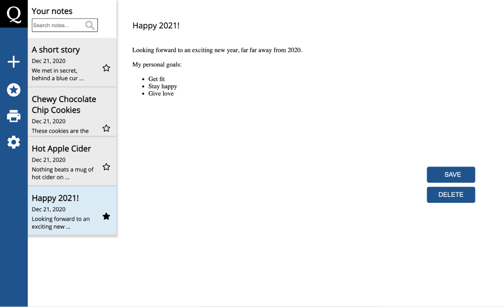

# Quire – the note-book  in your browser

“Quire” is the a new multifunctional note-book in your browser. This product allows you to create and personalize your notes and store them in local storage. 
HTLM 5, CSS3, JS (no frameworks) and CK Editor 5, a rich text editor library has been used to develop thee book. It  is  responsive and compatible with Chrome, FireFox and Safari.

## Functions
Create notes, search, save, update, delete and mark your note as favourite.
The Quire product itself is also available in dark mode.   

## The process
The project was set up as if it was in for a company on the market . The project had its own project owner and a CTO and a scrum methodology was used to develop the note-book. The group members daily scrums, weekly meetings with the project owner and weekly code reviews with the CTO. Feel free to look at our scrum board on [Trello](https://trello.com/b/88BX5SUp/team-template)

## Contributors

### Negin Jalalian

 
 
 

Production focus:  Implemented the  rich text editor library, CK Editor.  Developed  the  search function and the dark mode option. Worked on the CSS and the  responsive design features. This was  the first project where I used Git and GitHub. 

[Github](https://github.com/negin1) & [LinkedIn](https://www.linkedin.com/in/negin-jalalian-68324824/)

Anna Pettersson
Production focus: JS-structure for creating and saving notes in local storage + render notes in gray note bar, HTML5 & CSS3 page layout, implementation of CK Editor 5 & Moment library, responsive design features and intro pop up. 
[Github](https://github.com/bannanaz) & [LinkedIn](https://www.linkedin.com/in/anlepet/)
### Anna Pettersson
Production focus: JS-structure for creating and saving notes in local storage + render notes in gray note bar, HTML5 & CSS3 page layout, implementation of CK Editor 5 & Moment library, responsive design features and intro pop up.  
[Github](https://github.com/bannanaz) & [LinkedIn](https://www.linkedin.com/in/anlepet/)

### Mathilda Storm
Production focus: Contributed with a JavaScript function that makes it possible to bookmark favorite notes and get all favorites listed in Quire. The course of the project encompasses JS / HTML/ CSS/ GIT / GITHUB. Scrum master limited time during the project. Developed basis for the team's Trello Board which is a mix of Scrum + Kanban.  
Github & LinkedIn

### Rocky Miah  
Production focus:  
Github & LinkedIn  

