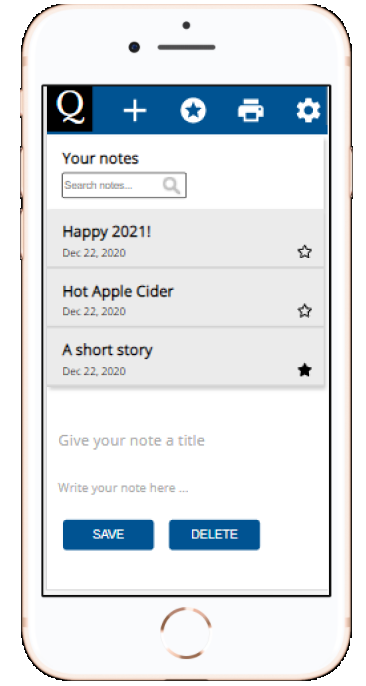

# Quire – the notebook  in your browser

Quire is the new multifunctional notebook in your browser. It allows you to create and personalize your notes and store them in local storage. You can  mark your note as favourite, search for yur notes and delete them.
 

HTLM 5, CSS3, JS and  the  rich text editor library CK Editor 5 have been used to develop the notebook. It  is  responsive and compatible with Chrome, FireFox and Safari. Quire is available in dark mode.   
 
 

  <tr>
    <td></td>
     <td></td>
  </tr>
 

## The process 
The project was set up as if it was for a tech company. The project had its own project owner and a CTO and a scrum methodology was used to develop the notebook. The group members had daily scrums, weekly meetings with the project owner and weekly code reviews with the CTO. Feel free to look at the  scrum board on [Trello](https://trello.com/b/88BX5SUp/team-template).
 
 

## Contributors 

 

### Negin Jalaian
 Production focus:   Implementation of CK Editor 5, developed  the  search function and the dark mode feature. Worked on the  HTLM, CSS and the  responsive design features. This was  the first project where I used Git and GitHub. 

[Github](https://github.com/negin1) & [LinkedIn](https://www.linkedin.com/in/negin-jalalian-68324824/)
 
 

### Anna Pettersson
Production focus: JS-structure for creating and saving notes in local storage + render notes in gray note bar, HTML5 & CSS3 page layout, implementation of CK Editor 5 & Moment library, responsive design features and intro pop up.  
[Github](https://github.com/bannanaz) & [LinkedIn](https://www.linkedin.com/in/anlepet/)
 
 
 

### Mathilda Storm
Production focus: Contributed with a JavaScript function that makes it possible to bookmark favorite notes and get all favorites listed in Quire. The course of the project encompasses JS / HTML/ CSS/ GIT / GITHUB. Scrum master limited time during the project. Developed basis for the team's Trello Board which is a mix of Scrum + Kanban.  
Github & LinkedIn
 
 
 

### Rocky Miah
Production focus:  
Github & LinkedIn

